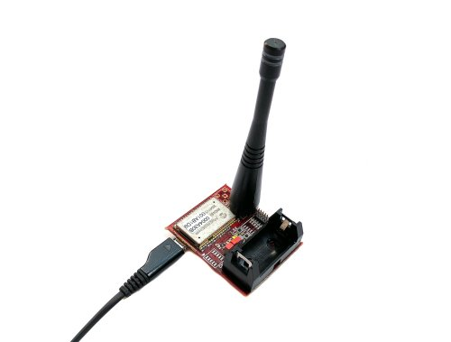

.. index:: fix

.. _fixboard:

How to fix the MBED firmware
----------------------------

This procedure has to be followed only if the MBED mass storage it isn't recognized when you connect the board to the PC and the MBED drivers are installed in windows.
The board uses the **MK20** microprocessor in order to implementing the MBED interface. In this guide we will upload the firmware for the **MK20**. In this way the MBED interface will work again.

1. Connect the board to the PC via USB cable.

2. Switch on the Lora Sensor Node keeping the **S3** button pressed.

.. image:: _static/board_s2_s3.jpg

3. If the previously steps are done correctly will appear a window named **BOOTLOADER**.

4. Download the file `k20dx128_kl26z_if_mbed.bin <_static/k20dx128_kl26z_if_mbed.bin>`_.

5. And copy the file **k20dx128_kl26z_if_mbed.bin** into the **BOOTLOADER** mass storage.

6. The Green led on the board will blink while the file is programmed into the device flash memory.

7. Unplug and replug the board from the PC. If the procedure has been successfull will popup the **MBED** window.

8. Now with the **MBED** window it is possible update the firmware for the **KL26Z** microprocessor. See the :ref:`quick15` paragraph.

