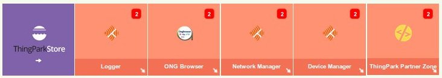
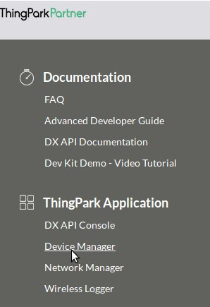
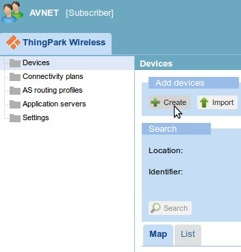
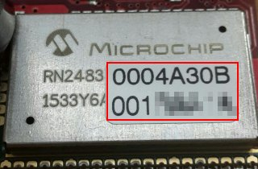
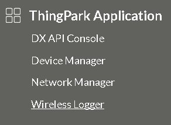
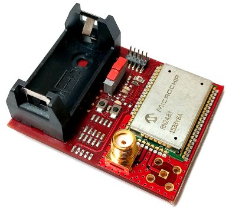
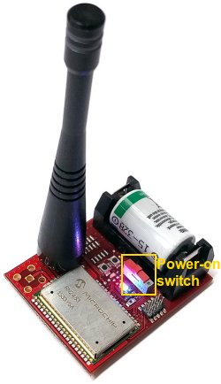
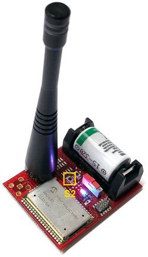
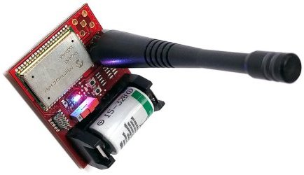
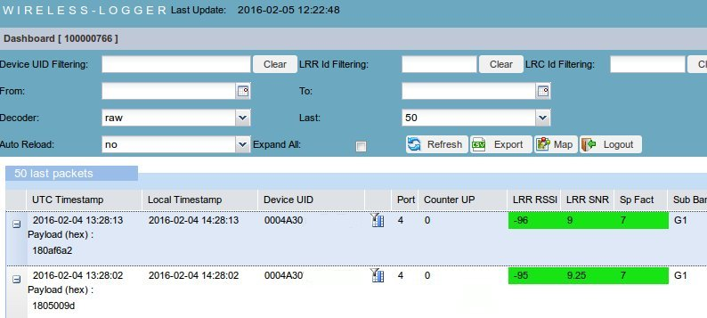

.. index:: qs

.. _quick:

Quick start guide
-----------------

In order to see working the Sensor Node Lora you have to register the device on the `activity website <http://actility.thingpark.com/portal/web>`_ clicking on **Create an account**.
After the registration login and you will access the main page.

First up we have to register your Microchip RN2483 device, to do this, click on **Device Manager** arrow to open a new window.

Click the right mouse button on the **Devices** folder and select **+ Create**.

In this form you have to insert the data we have stored in the RN2483. The following fields are mandatory:

- **Device EUI**: the 16-hex identification key of the device. It is unique for every device, you can read it on the label of the board as in the image. For example the code can be **0004A30B001B9954**

- **Network address**: last 4 less significant bytes from the Device EUI key, for example if the code is **0004A30B001B9954** then the network address will be **001B9954**
- **Device profile**: **LoRaWAN 1.0 class A**
- **Network key (hexa)**: we have already saved it in the RN2834 device, it is the **Device EUI** key copied *twice*, for example if the device EUI is **0004A30B001B9954** then the **network key** you have to insert will be **0004A30B001B99540004A30B001B9954**.
- **Application keys**: Insert **AFBECD56473829100192837465FAEBDC**, port **4**. We have saved it in the RN2834 device.
- **Connectivity plan**: choose yours

Optional field but useful:

- **Name**: insert a name just to recognize your device.

Then click on the top right **+ create**.

.. warning::

    If some key is wrong then the device will be unable to send data correctly in the Lora network.

After the registration, you can close the window device manager and on the main page go to **Logger**.

Here you will see all the messages sent by your device. Now take your board:

insert antenna and battery and keeping the board on the table switch on the Lora Sensor Node.

Now the device is in sleeping mode, in 30 seconds it will wake up and it is going to sent a message. For skipping the sleeping phase, press **S2** button.

After pressing **S2** button you will see the first message sent by your device. Now tilt your board to 90 degrees and wait 30 seconds.

The board will send another message. Now it's time to see the data sent. Power off the board. And in the logger window, you will have 2 rows, every row is a message received from the server.
If you click on the **+** node you can see the unencrypted data received **Payload (hex):**. All messages start with the number 18, the other three number couples are the data read from the accelerometer mounted on the board. You will see the data changed when you have tilted the board and sent the second message.

