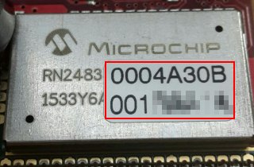
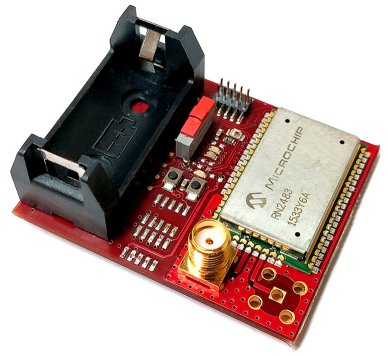
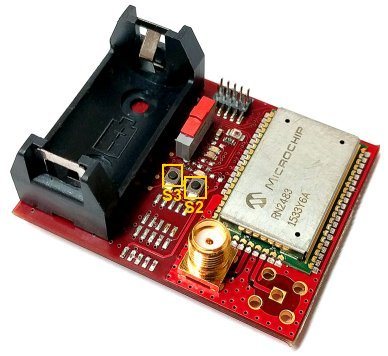
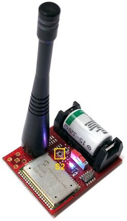

.. index:: qs1.3

.. _quick13:

Quick start guide with firmware 1.3 or major
--------------------------------------------

If you don't have a firmware 1.3 or major please go to develompent :ref:`develop`.

In order to see working the Sensor Node Lora you have to register the device on the `activity website <http://actility.thingpark.com/portal/web>`_ clicking on **Create an account**.
After the registration login and you will access the main page.

.. image:: _static/actility_main.jpg

First up we have to register your Microchip RN2483 device, to do this, click on **Device Manager** arrow to open a new window.

.. image:: _static/actility_device_manager.jpg

Click the right mouse button on the **Devices** folder and select **+ Create**.

.. image:: _static/actility_create.jpg

In this form you have to insert the data we have stored in the RN2483. The following fields are mandatory:

- **Device EUI**: the 16-hex identification key of the device. It is unique for every device, you can read it on the label of the board as in the image. For example the code can be **0004A30B001B9954**

- **Network Address**: This is the **device address** provided by the operator, contains the NetworkID where you want to connect the device.
- **Device profile**: **LoRaWAN 1.0 class A**
- **Network key (hexa)**: we have already saved it in the RN2834 device, it is the **Device EUI** key copied *twice*, for example if the device EUI is **0004A30B001B9954** then the **network session key** you have to insert will be **0004A30B001B99540004A30B001B9954**.
- **Application keys**: Insert **AFBECD56473829100192837465FAEBDC**, port **4**. We have saved it in the RN2834 device. This is the **application sessio key**.
- **Connectivity plan**: choose yours

Optional field but useful:

- **Name**: insert a name just to recognize your device.

Then click on the top right **+ create**.

.. warning::

    If some key is wrong then the device will be unable to send data correctly in the Lora network.

After the registration, you can close the window device manager and on the main page go to **Logger**.

.. image:: _static/actility_logger.jpg

Here you will see all the messages sent by your device. Now take your board:

The board doesn't have the correct **device address** in order to send correctly messages to your operator, so you have to set it. Follow next steps correctly:

1. Insert antenna and Micro-USB from the windows PC to the board and put the board on the table.

2. Download and install the drivers for windows from mbed website,

.. image:: _static/download_mbed_driver.jpg

3. Now switch on the Lora Sensor Node.

.. image:: _static/board_switch.jpg

5. If the MBED Windows serial port driver is installed correctly Windows will recognize the board as a memory storage called MBED and as a Serial Com Port.

.. image:: _static/storage_mbed.jpg

6. Now we have to connect a terminal to the Serial Com. First step, find which number is, going to “Device Manager” and finding the node called “Ports (COM and LPT)”. In this example the number port is 170.

.. image:: _static/device_manager.jpg

4. Open a terminal like **putty**, you can find it `here <https://the.earth.li/~sgtatham/putty/latest/x86/putty.exe>`_. Launch it and set the properties signed in red in the figures:

.. image:: _static/putty_session.jpg

.. image:: _static/putty_serial.jpg

5. Press the **Open** button. Now reset the board pressing **S3** button and after keep the **S2** button pressed for 5 seconds. 

6. On the putty console you will see the starting boot text:

.. image:: _static/console_login.jpg

7. Keeping the **S2** button pressed you will see after some seconds the text "**devaddr programming mode actived**". Now you can insert the 8 hexs **networkID** provided by your operator. After the last character inserted this value will be memorized and the text "**devaddr changed successfully**" will appear.

.. image:: _static/console_devaddr.jpg

Now the device is in sleeping mode, in 2 minutes it will wake up and it is going to send a message. For skipping the sleeping phase, press **S2** button.

After pressing **S2** button you will see the first message sent by your device. Now tilt your board to 90 degrees and wait 30 seconds.

.. image:: _static/board_tilt.jpg

The board will send another message. Now it's time to see the data sent. Power off the board. And in the logger window, you will have 2 rows, every row is a message received from the server.
If you click on the **+** node you can see the unencrypted data received **Payload (hex):**. All messages start with the number 18, the other three number couples are the data read from the accelerometer mounted on the board. You will see the data changed when you have tilted the board and sent the second message.

.. image:: _static/actility_logger2.jpg

