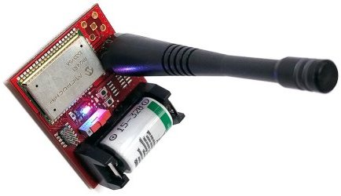
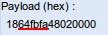

.. index:: qs1.5

.. _quick15:

Quick start guide for firmware 1.4 or major
-------------------------------------------

This guide permits to send messages over the Lora network. This page is written for Windows users.

Check on the backside of the board a label like this one:

If the serial number *S/N* is lesser than **199** then you have to update the firwmare otherwise skip the next paragraph.

Update firmware
***************

Update your board with the lastest firmware avaiable:

1. Download the file `Lora_v15b.bin.zip <http://downloads.architechboards.com/doc/BAEVTSS002_BAEVTSS003/revB/Lora_v15b.bin.zip>`_ and unzip it.

2. Connect the board to the PC via Mini Usb cable.

.. image:: _static/board_usb.jpg

3. Go to the `mbed site <https://developer.mbed.org/handbook/Windows-serial-configuration>`_.

4. Download the lastest mbed serial port driver, it is named as **mbedWinSerial**.

5. Install the driver.

6. When the driver is installed, a MBED mass storage device and a Serial line and a HID device are finded out. Open the MBED mass storage.

.. image:: _static/mbed_open.jpg

7. Copy the file **Lora_v15b.bin** into the MBED mass storage.

8. The Green led on the board will blink while the file is programmed into the device flash memory.

Register Module
***************

1. In order to see working the Sensor Node Lora you have to register the device on the `activity website <http://actility.thingpark.com/portal/web>`_ clicking on **Create an account**. 

2. After the registration login and you will access the main page.

.. image:: _static/actility_main.jpg

3. Register your Microchip RN2483 device, to do this, click on **Device Manager** arrow to open a new window.

.. image:: _static/actility_device_manager.jpg

4. Click the right mouse button on the **Devices** folder and select **+ Create**.

.. image:: _static/actility_create.jpg

5. In this form you have to insert the data we have stored in the RN2483. The following fields are mandatory:

- **Device EUI**: the 16-hex identification key of the device. It is unique for every device, you can read it on the label of the board as in the image. For example the code can be **0004A30B001B9954**

.. image:: _static/euid_label.jpg

- **Network Address**: This is the **device address** provided by the operator, contains the NetworkID where you want to connect the device.
- **Device profile**: **LoRaWAN 1.0 class A**
- **Network key (hexa)**: we have already saved it in the RN2834 device, it is the **Device EUI** key copied *twice*, for example if the device EUI is **0004A30B001B9954** then the **network session key** you have to insert will be **0004A30B001B99540004A30B001B9954**.
- **Application keys**: Insert **AFBECD56473829100192837465FAEBDC**, port **4**. We have saved it in the RN2834 device. This is the **application sessio key**.
- **Connectivity plan**: choose yours

Optional field but useful:

- **Name**: insert a name just to recognize your device.

6. Click on the top right **+ create**.

.. warning::

    If some key is wrong then the device will be unable to send data correctly in the Lora network.

7. After the registration, you can close the window device manager and on the main page go to **Logger**.

.. image:: _static/actility_logger.jpg

8. In this page you will see all the messages sent by your device. 

Use your board
**************

Now take your board:

.. image:: _static/board_bare.jpg

The board doesn't have the correct **device address** in order to send correctly messages to your operator, so you have to set it. Follow next steps correctly:

1. Insert antenna and Micro-USB from the windows PC to the board and put the board on the table.

2. If you did not installed the mbed serial driver then go to `mbed website <https://developer.mbed.org/handbook/Windows-serial-configuration>`_ otherwise go to the step **5**

3. Download the lastest mbed serial port driver, it is named as **mbedWinSerial**.

4. Install the driver.

5. Now switch on the Lora Sensor Node.

.. image:: _static/board_switch.jpg

6. If the MBED Windows serial port driver is installed correctly Windows will recognize the board as a memory storage called MBED and as a Serial Com Port.

7. Now we have to connect a terminal to the Serial Com. First step, find which number is, going to “Device Manager” and finding the node called “Ports (COM and LPT)”. In this example the number port is 170.

8. Open a terminal like **putty**, you can find it `here <https://the.earth.li/~sgtatham/putty/latest/x86/putty.exe>`_. Launch it and set the properties signed in red in the figures:

.. image:: _static/putty_session.jpg

.. image:: _static/putty_serial.jpg

9. Press the **Open** button. Now reset the board pressing **S3** button and after keep the **S2** button pressed for 5 seconds. 

.. image:: _static/board_s2_s3.jpg

10. On the putty console you will see the starting boot text:

::

    BAEVTSS002 firmware version 1.5b
    RN2483 1.0.1 Dec 15 2015 09:38:06

11. Keeping the **S2** button pressed you will see after some seconds the text **Please release the button S2**. Will be displayed a menu like this one:

::

  *** MENU CONFIG RN2483 ***
  Enter 0 to print this menu
  Enter 1 to see values in DEVEUI and DEVADDR registers
  Enter 2 to modify DEVEUI
  Enter 3 to modify DEVADDR
  Enter 4 to modify APPSKEY
  Enter 5 to modify NWKSKEY
  Enter 6 to save changes
  Enter 7 to Microchip default reset
  Enter 8 to Avnet default reset
  Enter 9 to exit

From this menu you will be able to change the registers **DEVEUI**, **DEVADDR**, **APPSKEY** and **NWKSKEY**. furthermore it is possible reset the RN2483 with factory reset by Microchip or by Avnet. 

.. warning::

  The BAEVTSS002 is setted by default with **Avnet reset**. 

12. In this case, we want change the networkID so you have to press the key **2** to be able to change the **DEVEUI** register, it will be showed:

::

  Changing deveui register, current value: 001B9954
  Enter new deveui value, 8 hex numbers lenght (press ENTER to abort):
  >>

As you can see in the first line it is displayed the current value in the register and how many numbers you have to insert in order to change the register.

.. note::

  The current value of the register it is displayed only for **DEVEUI** and **DEVADDR** registers. **APPSKEY** and **NWKSKEY** register are write-only so their current value won't be showed.

13. Insert **8** hexs numbers, for example **12345678**. After the last key will be pressed automatically the value of register will change.

::

  Changing deveui register, current value: 001B9954
  Enter new deveui value, 8 hex numbers lenght (press ENTER to abort):
  >> 12345678

.. note:: 

  If you press Enter before to insert all the keys the procedure will abort. **12345678** is just for example, please contact your Operator in order to know which networkID you have to use. Without the correct networkID you won't be able to send messages.

14. If the procedure will have success will appear the message **value changed**:

::

  Changing deveui register, current value: **001B9954**
  Enter new deveui value, 8 hex numbers lenght (press ENTER to abort):
  >> 12345678
  value changed

15. Now the **DEVEUI** register is changed but if the **RN2843** will be turned off the modify will be lost. In order to keep the modify you have to save it. To do it, from the menu press the key **6** referred to *Enter 6 to save changes*. During the saving will be showed:

::

  Saving modifies, please don't turn off the device...
  please wait...

16. The saving will terminate when will appear the message **success**:

::

  Saving modifies, please don't turn off the device...
  please wait...success

.. note::

  If you have to change other values use the appropiate keys. If you want only see the value of the readable register press the key **1**

17. Now to start the demo exit from the menu pressing the key **9**. The device will enter automatically in **sleep mode**.

18. Every 2 minutes it will wake up for a short time in order to send a message. It is possible skipping the sleeping phase pressing the **S2** button. When the board is sending a message a blue led will be turned on.

.. image:: _static/board_s2.jpg

19. After pressing **S2** button you will see the first message sent by your device. Now tilt your board to 90 degrees and wait 30 seconds.

20. The board will send another message. 

21. Now it's time to see the data sent. Power off the board. 

22. In the logger window, you will have 2 rows, every row is a message received from the server.

23. If you click on the **+** node you can see the unencrypted data received **Payload (hex):**. 

24. All messages start with the number 18, the other three number couples are the data read from the accelerometer mounted on the board. You will see the data changed when you have tilted the board and sent the second message. The accelerometer data are marked in red.

25. From the firmware version **1.5** sends also the light ambient value, you can read it from the payload after the number 48. In the following figure it is marked with a red line.

The dark will be rappresented with a low number and a strong light with a high number.

LEDs functionality
******************

The board has four LEDs:

+---------+-----------+-----------------+
| **LED** | **Color** | **Brief Note**  |
+---------+-----------+-----------------+
| **1**   | Blue      | RN2483 GPIO_12  |
+---------+-----------+-----------------+
| **2**   | Red       | RN2483 GPIO_13  |
+---------+-----------+-----------------+
| **3**   | ---       | not fitted      |
+---------+-----------+-----------------+
| **4**   | Green     | OpenSDA & MBED  |
+---------+-----------+-----------------+
| **5**   | Blue      | Firmware status |
+---------+-----------+-----------------+

- **LED1** & **LED2** are connected directly via RN2483 GPIOs. By default, they are turned ON during Power-On and on Reset status of the RN2483. After that the firmware sends commands to the RN2483 in order to turn OFF the LEDs. The purpose is to save battery life.

- **LED4** when the Mini-USB cable is connected the led will be turned ON.

- **LED5** is turned ON when the KL26Z is running sending a message over Lora network. It is turned OFF during the deepsleep phase.

