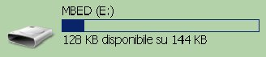
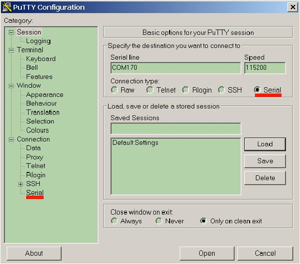
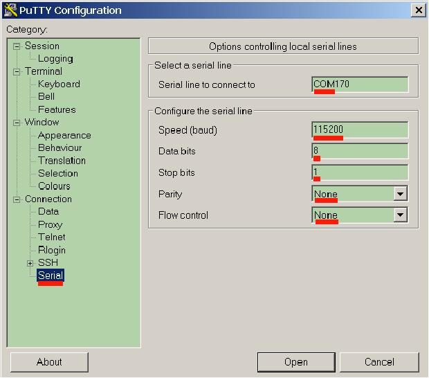
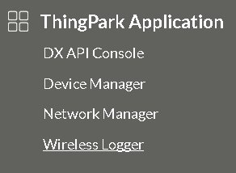

.. index:: qs1.6

.. _quick16:

Quick start guide for firmware 1.6 or major
-------------------------------------------

Update firmware
***************

If you are unsure about which firmware version you have then update your board with the lastest firmware avaiable.

1. Download the file `Lora_v16b.bin.zip <http://downloads.architechboards.com/doc/BAEVTSS002_BAEVTSS003/revB/Lora_v16b.bin.zip>`_ and unzip it.

2. Connect the board to the PC via Mini Usb cable.

.. image:: _static/board_usb.jpg

3. Go to the `mbed site <https://developer.mbed.org/handbook/Windows-serial-configuration>`_.

4. Download the lastest mbed serial port driver, it is named as **mbedWinSerial**.

5. Install the driver.

6. When the driver is installed, a MBED mass storage device and a Serial line and a HID device are finded out. Open the MBED mass storage.

.. warning::

  If the window opened is named **BOOTLOADER** repeat the procedure, the window **must be named MBED**.

7. Copy the file **Lora_v16b.bin** into the MBED mass storage.

8. The Green led on the board will blink while the file is programmed into the device flash memory.

.. warning::

  If accidentally has been copied the firmware in the **BOOTLOADER** window you have corrupted the MBED firmware and you have to fix it. Please read the fix procedure going to the page :ref:`fixboard`

Setup Module
************

Now you have to choose which kind of connection you want **OTAA** or **ABP**. 

* Over-the-Air Activation (OTAA) is the most secure way to connect the device. The module will perform a join-procedure with the network, during which a **dynamic DevAddr** is assigned and security keys are negotiated with the device.

* The Activation-by-Personalization permit you to hardcode the **DevAddr** as well as the security keys in the module. This way is simpler than OTAA, because you skip the join procedure, but it is less safer than the OTAA.

You have to setup the board in order to send correctly messages to your operator. Follow next steps correctly:

1. Insert antenna and Micro-USB from the windows PC to the board and put the board on the table.

2. If you did not installed the mbed serial driver then go to `mbed website <https://developer.mbed.org/handbook/Windows-serial-configuration>`_ otherwise go to the step **5**

3. Download the lastest mbed serial port driver, it is named as **mbedWinSerial**.

4. Install the driver.

5. Now switch on the Lora Sensor Node.

.. image:: _static/board_switch.jpg

6. If the MBED Windows serial port driver is installed correctly Windows will recognize the board as a memory storage called MBED and as a Serial Com Port.

.. image:: _static/storage_mbed.jpg

7. Now we have to connect a terminal to the Serial Com. First step, find which number is, going to “Device Manager” and finding the node called “Ports (COM and LPT)”. In this example the number port is 170.

.. image:: _static/device_manager.jpg

8. Open a terminal like **putty**, you can find it `here <https://the.earth.li/~sgtatham/putty/latest/x86/putty.exe>`_. Launch it and set the properties signed in red in the figures:

9. Press the **Open** button. Now reset the board pressing **S3** button 

10. On the putty console you will see the booting text:

::

    Module Version: BAEVTSS002 firmware version 1.6
    RN2483 1.0.1 Dec 15 2015 09:38:06

11. After that you have 5 seconds in order to press **S2** button. Doing so it is possible enter in a menu where you can run special commands.

12. From this menu you will be able to setup your board:

::

    Send commands to RN2483. Write 'quit' to exit.
	Enter 1 > Write/Read REGS
	Enter 2 > RESET Module
	Enter 3 > Send Payload
	Enter 4 > Advanced Settings

Now if you want to use **OTAA** go to the paragraph :ref:`OTAA_config` otherwise if you want to use **ABP** go to :ref:`ABP_config`

.. _OTAA_config:

OTAA Configuration
==================

The OTAA configuration requires the following parameters:

- **DevEUI**: 64 bit end-device identifier. It is unique for every device.
- **AppEUI**: 64 bit application identifier. It is unique for every device.
- **AppKey**: 64 bit application identifier. It is unique for every device.

1. From the main menu press '**1**' you will select "**Write/Read REGS**". Will be showed this menu:

::

    Enter 1 > set DEVADDR (ABP mandatory)
    Enter 2 > set NWKSKEY (ABP mandatory)
    Enter 3 > set APPSKEY (ABP optional)
    Enter 4 > set DEVEUI (OTAA and ABP mandatory)
    Enter 5 > set APPEUI (OTAA mandatory)
    Enter 6 > set APPKEY (OTAA mandatory)
    Enter 7 > Save Changes
    Enter 8 < back

2. Enter **4** to insert **DevEUI** address.

3. Insert **16** hexadecimal numbers. You can read the last numbers on the label of the board as in the image.

.. image:: _static/euid_label.jpg

4. If it succeed will apper *value changed*

5. Now you have to program the **AppEUI** pressing the key **5**

6. Insert **16** hexadecimal numbers. For example **0123456789ABCDEF**.

7. If it succeed will apper *value changed*

8. The last value to insert is the APPKEY pressing the key **6**

9. Insert **32** hexadecimal numbers. For example **0123456789ABCDEF0123456789ABCDEF**.

10. If it succeed will apper *value changed*

11. Now you have to save these changes pressing the key **7**

Once the board is configurated correctly you have to register the device to your provider. In this guide we used `Thingpark <https://www.thingpark.com>`_. To follow the next steps go to :ref:`web_config`.

.. _ABP_config:

ABP Configuration
=================

The ABP configuration requires the following parameters:

- **DevAddr**: 32 bit device address (non-unique)
- **NwkSKey**: 64 bit register, it is used for network layer security
- **DevEUI**: 64 bit end-device identifier. It is unique for every device

1. From the main menu press '**1**' you will select "**Write/Read REGS**". Will be showed this menu:

::

    Enter 1 > set DEVADDR (ABP mandatory)
    Enter 2 > set NWKSKEY (ABP mandatory)
    Enter 3 > set APPSKEY (ABP optional)
    Enter 4 > set DEVEUI (OTAA and ABP mandatory)
    Enter 5 > set APPEUI (OTAA mandatory)
    Enter 6 > set APPKEY (OTAA mandatory)
    Enter 7 > Save Changes
    Enter 8 < back

2. Enter **1** to insert **DevAddr** address.

3. Insert **8** hexadecimal numbers. You can read the last numbers on the label of the board as in the image.

.. image:: _static/euid_label.jpg

4. If it succeed will apper *value changed*

5. Now you have to program the **NwkSKey** pressing the key **2**

6. Insert **32** hexadecimal numbers. For example **0123456789ABCDEF0123456789ABCDEF**.

7. If it succeed will apper *value changed*

8. The last value to insert is the **DevEUI** pressing the key **4**

9. Insert **32** hexadecimal numbers. For example **12345678901234567890123456789012**.

10. If it succeed will apper *value changed*

11. Now you have to save these changes pressing the key **7**

12. Once the board is configurated correctly you have to register the device to your provider. In this guide we used `Thingpark <https://www.thingpark.com>`_. To follow the next steps go to :ref:`web_config`.

.. _web_config:

Register Module
***************

1. In order to see working the Sensor Node Lora you have to register the device on the `activity website <https://partners.thingpark.com/>`_ clicking on **Try**. 

2. After the registration login and you will access the main page.

3. Register your Microchip RN2483 device, to do this, click on **Device Manager** to open a new window.

.. image:: _static/actility_device_manager.jpg

4. Click on the **+ Create** button.

.. image:: _static/actility_create.jpg

5. In this form you have to insert the data we have stored in the RN2483. You have to choose if to use ABP or OTAA mode in the first field named **Device activation** of the **Device identification** group.

6. Insert in every field the values wrote before in the device (:ref:`OTAA_config` or :ref:`ABP_config` paragraph).

7. Make sure to define as **Device profile**: **LoRaWAN 1.0 - class A - ETSI**

8. Select a valid **Connection plan**

Optional field but useful:

- **Name**: insert a name just to recognize your device.

6. Click on the top right **+ create**.

.. warning::

    If you don't enter the same keys wrote in the device you will be unable to send data correctly in the Lora network.

7. After the registration, you can close the window device manager and on the main page go to **Logger**.

8. In this page you will see all the messages sent by your device.

Use your board
**************

17. From the **main menu** of the device you have to select which mode will be used in the demo.
You can have these options:

::

    Enter 5 > Change mode Demo to OTAA join
    Enter 6 < Start Demo in ABP mode

or

::

    Enter 5 > Change mode Demo to ABP join
    Enter 6 < Start Demo in OTAA mode

Select the correct one, your choose will be stored in flash memory and used every time you will turn-on the board.
Then start the demo, the device will enter automatically in **sleep mode**.

18. Every 2 minutes it will wake up for a short time in order to send a message. It is possible skipping the sleeping phase pressing the **S2** button. When the board is sending a message a blue led will be turned on.

.. image:: _static/board_s2.jpg

19. After pressing **S2** button you will see the first message sent by your device. Now tilt your board to 90 degrees and wait 30 seconds.

.. image:: _static/board_tilt.jpg

20. The board will send another message. 

21. Now it's time to see the data sent. Power off the board. 

22. In the logger window, you will have 2 rows, every row is a message received from the server.

.. image:: _static/actility_logger_messages.jpg

23. If you click on the **+** node you can see the unencrypted data received **Payload (hex):**. 

.. image:: _static/actility_logger_messages2.jpg

24. All messages start with the number 18, the other three number couples are the data read from the accelerometer mounted on the board. You will see the data changed when you have tilted the board and sent the second message. The accelerometer data are marked in red.

.. image:: _static/actility_logger3.jpg

25. From the firmware version **1.6** sends also the light ambient value, you can read it from the payload after the number 48. In the following figure it is marked with a red line.

.. image:: _static/actility_logger4.jpg

The dark will be rappresented with a low number and a strong light with a high number.

LEDs functionality
******************

The board has four LEDs:

.. image:: _static/board_leds.jpg

+---------+-----------+-----------------+
| **LED** | **Color** | **Brief Note**  |
+---------+-----------+-----------------+
| **1**   | Blue      | RN2483 GPIO_12  |
+---------+-----------+-----------------+
| **2**   | Red       | RN2483 GPIO_13  |
+---------+-----------+-----------------+
| **3**   | ---       | not fitted      |
+---------+-----------+-----------------+
| **4**   | Green     | OpenSDA & MBED  |
+---------+-----------+-----------------+
| **5**   | Blue      | Firmware status |
+---------+-----------+-----------------+

- **LED1** & **LED2** are connected directly via RN2483 GPIOs. By default, they are turned ON during Power-On and on Reset status of the RN2483. After that the firmware sends commands to the RN2483 in order to turn OFF the LEDs. The purpose is to save battery life.

- **LED4** when the Mini-USB cable is connected the led will be turned ON.

- **LED5** is turned ON when the KL26Z is running sending a message over Lora network. It is turned OFF during the deepsleep phase.

